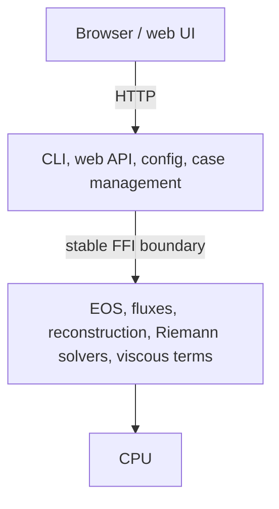

# nuFor

A CPU-first computational fluid dynamics research code built in Rust and Fortran.

> **Work in progress.** nuFor is not complete. Right now it can simulate a
> fixed set of cases through the web UI: the 1D Sod and Lax shock tubes, and
> the 2D and 3D spherical blast problem, with density / mach / pressure
> visualization, line probes, resolution comparison, and CSV / VTK / HDF5
> export. Full mesh upload (solve-on-imported-mesh), arbitrary boundary
> conditions, and general case setup from the browser are still under
> development. Those paths are driven from the CLI today and will land in the
> UI in later releases.

## Summary

nuFor solves the compressible Euler and Navier-Stokes equations on structured
grids in one, two, and three dimensions. A Rust application layer handles the
CLI, the web UI, and case orchestration, while Fortran owns the numerical
kernels across a narrow C ABI. Python is used for reference solutions and
verification, never the hot path. It builds with cargo, requires gfortran and
CMake (HDF5 optional), and runs on Linux.

## Project structure

```
nuFor/
├── crates/       Rust workspace (nufor-core, nufor-config, nufor-cli)
├── fortran/      Fortran numerical kernels, built via CMake from build.rs
├── python/       reference solutions, plotting, verification
├── cases/        runnable case files (case.toml + meshes)
├── docs/         this documentation site, built with Quartz
├── docs-site/    Quartz tooling and config
└── .github/      CI workflows
```

## Architecture



The Rust layer is the front door: it reads the case file, builds the mesh, and
drives the solve. The Fortran layer owns the physics. They cross a C-compatible
ABI of contiguous arrays, explicit lengths, and structured error codes.

## Testing

```
cargo test --workspace
```

This builds the Fortran kernels, links them, and runs the verification suite,
which includes shock tubes, oblique and reflected shocks, channel flow, and a
regression gate. Format and lint checks run the same way:

```
cargo fmt --check
cargo clippy --workspace --all-targets -- -D warnings
```

## Contributing

Branch off `main`, keep commits small and self-contained, and open a PR so CI
runs before merge. Code is lowercase single-sentence comments, snake_case
names, and LF line endings.

## License

GPL-3.0-only. See `LICENSE`.