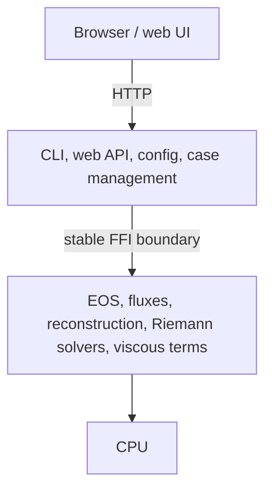

# nuFor

A CPU-first computational fluid dynamics research code built in Rust and Fortran.

> **Work in progress.** nuFor is not complete. The validated core today:
> 1D/2D/3D Euler, 2D/3D viscous Navier-Stokes, Spalart-Allmaras RANS,
> masked bodies and cut cells, an axisymmetric solver, and an
> equilibrium-air closure (CEA table) on the hypersonic 2D paths —
> exercised across a four-station atmospheric-entry sweep with a
> 1280x640 anchor run. Spalart-Allmaras 3D, two-temperature
> nonequilibrium, and unstructured meshes are the next rungs on the
> [roadmap](docs/roadmap.md). Cases run from the CLI today; the web UI
> covers the fixed case set with field visualization, probes, and
> CSV / VTK / HDF5 export.

## Summary

nuFor solves the compressible Euler and Navier-Stokes equations on structured
grids in one, two, and three dimensions, with an axisymmetric form and a
tabulated equilibrium-air closure for hypersonic flows. A Rust application
layer handles the CLI, the web UI, and case orchestration, while Fortran owns
the numerical kernels across a narrow C ABI. Python is used for reference
solutions and verification, never the hot path. It builds with cargo, requires
gfortran and CMake (HDF5 optional), and runs on Linux.

## Project structure

```
nuFor/
├── crates/       Rust workspace (nufor-core, nufor-config, nufor-cli)
├── fortran/      Fortran numerical kernels, built via CMake from build.rs
├── python/       reference solutions, plotting, verification
├── cases/        runnable case files (case.toml + meshes)
├── docs/         this documentation site, built with Quartz
├── docs-site/    Quartz tooling and config
└── .github/      CI workflows
```

## Architecture


```mermaid
graph TD
    UI[Browser / web UI] -->|HTTP| RUST[Rust app layer]
    RUST[CLI, web API, config, case management]
    RUST -->|stable FFI boundary| FTN[Fortran numerical layer]
    FTN[EOS, fluxes, reconstruction, Riemann solvers, viscous terms]
    FTN --> CPU[CPU]
```

The Rust layer is the front door: it reads the case file, builds the mesh, and
drives the solve. The Fortran layer owns the physics. They cross a C-compatible
ABI of contiguous arrays, explicit lengths, and structured error codes.

## Testing

```
cargo test --workspace
```

This builds the Fortran kernels, links them, and runs the verification suite,
which includes shock tubes, oblique and reflected shocks, channel flow, and a
regression gate. Format and lint checks run the same way:

```
cargo fmt --check
cargo clippy --workspace --all-targets -- -D warnings
```

## Contributing

Branch off `main`, keep commits small and self-contained, and open a PR so CI
runs before merge. Code is lowercase single-sentence comments, snake_case
names, and LF line endings.

## License

GPL-3.0-only. See `LICENSE`.