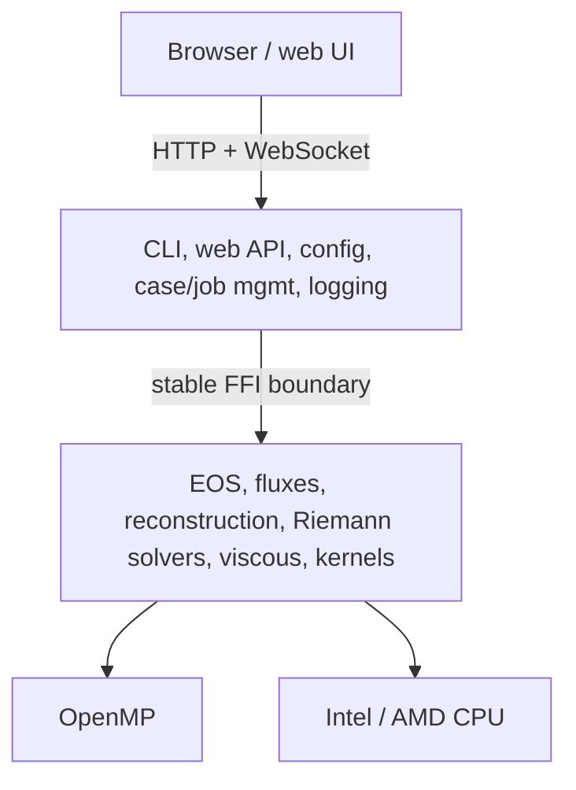

# Architecture

nuFor separates a Rust application layer from a Fortran numerical layer across
a narrow C ABI, with Python reserved for analysis and reference calculations
(never production hot loops).

## Language split

- **Rust** — application framework, CLI, web/API, orchestration, integration
  (spec 36).
- **Fortran** — numerical and physics kernels and dense array operations
  (spec 37).
- **Python** — analysis, reference solutions, plotting, verification,
  automation (spec 38).

## Interop

Rust and Fortran cross a deliberate C-compatible ABI: contiguous arrays with
explicit lengths, structured error codes, no Fortran derived-type leakage.
See  for the full design and its rules.

## Build

Cargo owns the Rust workspace; a `build.rs` drives CMake to compile the
Fortran kernels into a static archive and link them in. The tree is
`crates/` (Rust), `fortran/` (Fortran), `python/` (analysis), `cases/`
(runnable cases), `docs/` (this site).

## Areas

- [Numerics — 1D Euler](numerics/1d-euler.md)
- [Formats — case.toml](formats/case-toml.md)

## See also

- [[numerics/web-ui|Web UI]]
- [[formats/case-toml|case.toml format]]
- [[numerics/3d|3D foundations]]
- [[performance/optimization-ledger|Optimization ledger]]
