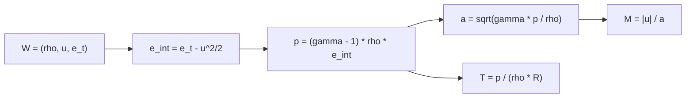

# Ideal-gas equation of state

The thermodynamic model for the 1D Euler milestone is a calorically perfect
ideal gas: constant ratio of specific heats `gamma`, constant specific gas
constant `R`, and the linear thermal law `p = rho*R*T`. Both constants come
from the `[physics]` section of the [case definition](../formats/case-toml.md), and all
of the recovery paths below live in the Fortran kernel layer behind the
, wrapped in `nufor-core` as `eos_pressure`,
`eos_sound_speed`, `eos_mach`, and `eos_temperature`.

## Relations

From the [primitive state](state-grid.md) `(rho, u, e_t)` the specific internal
energy is the total minus the kinetic part:

- **Pressure recovery** (spec 25): `p = (gamma - 1) * rho * e_int`, with
  `e_int = e_t - u^2/2`. This is the standard ideal-gas relation in the
  compressible-Euler literature (LeVeque 2002, Toro 2013); Clawpack's
  Riemann book states it as `p = rho * e * (gamma - 1)` for the specific
  internal energy `e`.
- **Sound speed**: `a = sqrt(gamma * p / rho)`, the acoustic wave speed that
  sets the CFL limit and the Euler characteristic speeds `u - a`, `u`,
  `u + a`.
- **Mach number**: `M = |u| / a`, the ratio that labels a state subsonic
  (`M < 1`) or supersonic (`M > 1`); boundary conditions and verification
  cases rely on it.
- **Temperature recovery**: `T = p / (rho * R)`, the ideal-gas thermal law
  with `R` in J/(kg · K). The case config uses SI units by default
  (`unit_system = "si"`).

## Physical-validity checks

The kernels enforce the invariants from spec 94 and the admissibility rules
from spec 138: an Euler state must have `rho > 0` and `p > 0`, which for an
ideal gas is equivalent to `e_int > 0`. Each kernel:

- rejects `rho <= 0` and `e_int <= 0` (or `p <= 0` where pressure is an
  input) with a structured numerical-failure code instead of writing a
  garbage state;
- rejects non-finite inputs (`NaN`, `Inf`) the same way, so a corrupted
  state cannot silently poison a run;
- rejects degenerate arguments up front: `gamma <= 1` for the pressure and
  sound-speed kernels, `R <= 0` for temperature.

These checks are the first line of the diagnostics story: a solver step that
produces negative density or pressure fails loudly here before the flux
update can run on it.

## Verification

The wrapper tests in `crates/nufor-core/tests/eos.rs` check: definition
values on exactly representable inputs, recovery of the Sod left state
(`rho = 1`, `u = 0`, `p = 1` with `gamma = 1.4`), closed-loop consistency
through `prim_to_cons`/`cons_to_prim` back to pressure and sound speed,
rejection of non-positive density, non-positive internal energy, non-positive
pressure, non-finite components, invalid `gamma` and `R`, mismatched and
empty slices, and single-cell calls.

## References

- LeVeque, R. J., *Finite Volume Methods for Hyperbolic Problems*, Cambridge
  University Press, 2002.
- Toro, E. F., *Riemann Solvers and Numerical Methods for Fluid Dynamics*,
  3rd ed., Springer, 2013.
- Clawpack, "The Euler equations of gas dynamics",
  https://www.clawpack.org/riemann_book/html/Euler.html (accessed
  2025-05-08).

## Related

- [Numerics — 1D state and uniform grid](state-grid.md) — the state variables
  these relations close
- [Numerics — 1D Euler](1d-euler.md) — the milestone this serves
- [Formats — case.toml (case definition)](../formats/case-toml.md) — where `gamma` and `R`
  come from
