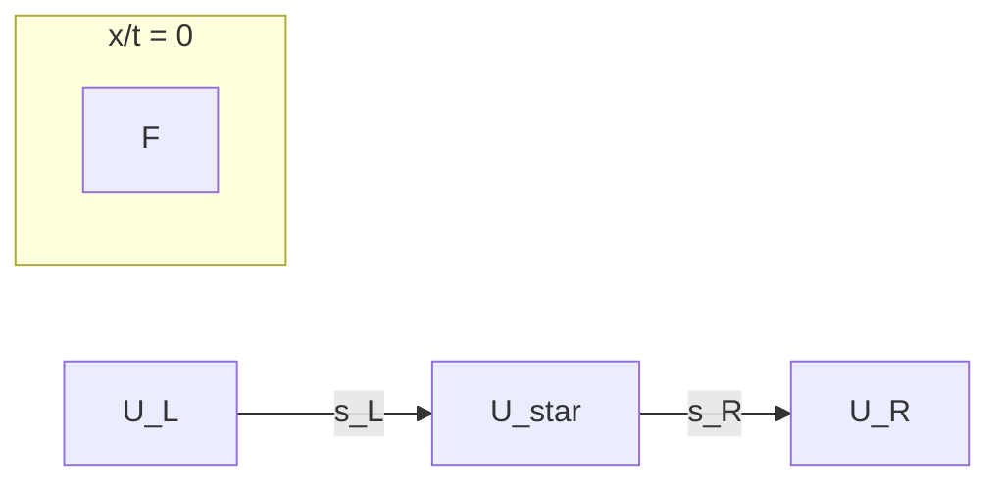
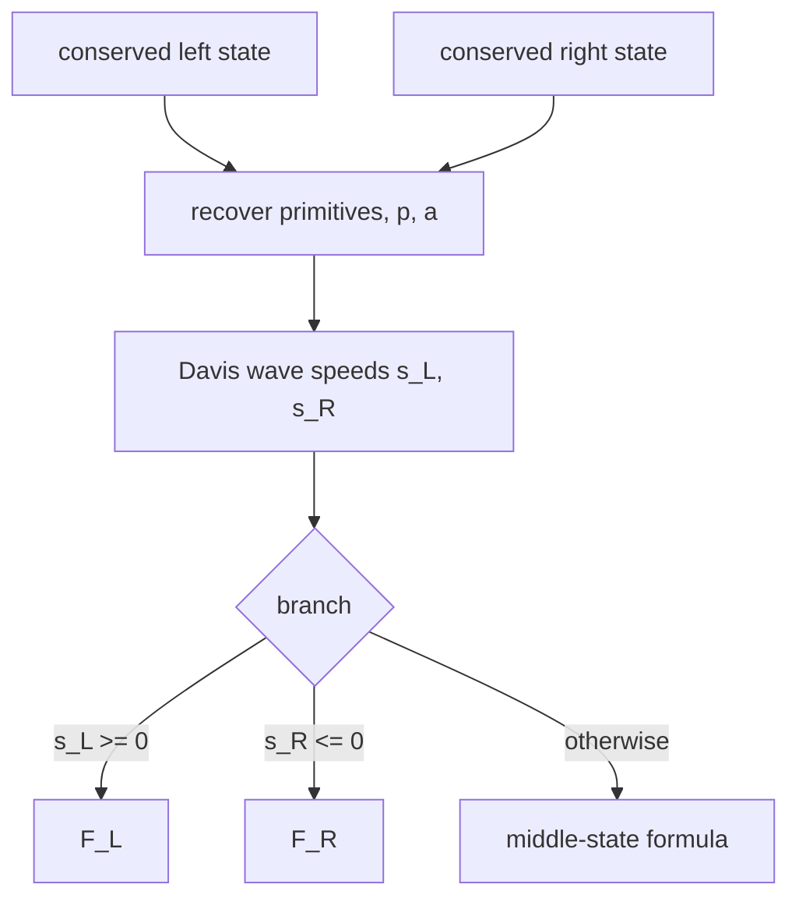

The baseline approximate Riemann solver for the 1D Euler milestone is the
Harten-Lax-van Leer (HLL) flux: two waves with a single intermediate state,
chosen conservatively so the numerical method stays conservative by
construction. See the  for the HLL-vs-HLLC
decision and sources.

## Two-wave model

HLL replaces the exact Riemann problem by three constant regions separated by
two waves traveling at speeds `s_L <= 0 <= s_R` (when the interface speed is
subsonic). The intermediate state is the unique value that satisfies the
integral form of the conservation law, so the scheme is conservative for any
choice of the two wave speeds:

For the 1D Euler equations with conserved state `U = (rho, m, E)` and
physical flux `F(U) = (rho u, rho u^2 + p, u (E + p))`, the HLL flux is

- `F_L` when `s_L >= 0` (the interface sees only the left state),
- `F_R` when `s_R <= 0` (only the right state),
- otherwise
  `F = (s_R F_L - s_L F_R + s_L s_R (U_R - U_L)) / (s_R - s_L)`.

## Wave speeds

The kernel uses the Davis estimates

- `s_L = min(u_L - a_L, u_R - a_R)`
- `s_R = max(u_L + a_L, u_R + a_R)`

which bound the characteristic speeds at the face from the two states alone,
with no Roe average and no iteration. `s_R - s_L` is strictly positive for
admissible states (both sound speeds positive), so the denominator never
vanishes. The arithmetic-average alternative is documented as inconsistent
in the literature and is not used.

## State validity

The kernel recovers primitives, pressure, and sound speed on both sides
through the [ideal-gas equation of state](../foundations/eos.md) and applies the same
admissibility rules as the EOS step: positive density and positive internal
energy, all components finite. A face violating these rules fails with a
structured numerical-failure code instead of producing a flux from an
unphysical state.

## Verification

The kernel is tested in `crates/nufor-core/tests/hll.rs` against the
published formula:

- identical states return the physical flux (exact),
- left- and right-supersonic faces return the physical flux of the upwind
  state (exact),
- the Sod face flux at `t = 0` matches the formula, momentum flux exactly 0.55,
- generic subsonic faces match a Rust reimplementation of the formula,
- several faces are processed in one call with per-face results,
- non-positive density, non-positive internal energy, non-finite states,
  invalid `gamma`, and mismatched or empty slices are rejected.

## Related

- [Numerics — 1D Euler milestone](../1d/1d-euler.md)
- [Numerics — Ideal-gas equation of state](../foundations/eos.md)
- [Numerics — 1D state and uniform grid](../foundations/state-grid.md)

## See also

- [[numerics/fluxes/hll-vs-hllc||HLL vs HLLC]]
- [[numerics/foundations/time-step||CFL time-step]]
- [[numerics/1d/1d-euler||1D Euler]]
- [[numerics/2d/2d-euler||2D Euler solver]]
