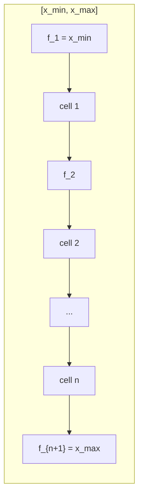

# 1D state and uniform grid

The 1D Euler milestone builds on a fixed state layout and a uniform
control-volume geometry. Both live in the Fortran kernel layer
(`fortran/api/nuforkernels.f90`) behind the [[ffi-boundary|FFI boundary]],
wrapped in `nufor-core` as `grid1d`, `prim_to_cons`, and `cons_to_prim`.

## State variables

At each cell the flow is described by either the conserved or the primitive
vector; both hold three components.

- **Conserved** vector `U = (rho, m, E)`: density, momentum per volume
  `m = rho*u`, and total energy per volume `E = rho*e_t`. The finite-volume
  update advances this vector.
- **Primitive** vector `W = (rho, u, e_t)`: density, velocity, and total
  specific energy `e_t`. Initial conditions and boundary data are usually
  written in primitives.
- Conversion is deliberately **EOS-free**: `e_t` stays total. The split into
  internal energy plus `u^2/2` and the pressure recovery belong to the
  [[1d-euler|EOS step]] that follows.
- Both directions reject non-positive density (`rho <= 0`) with a structured
  numerical-failure code rather than producing a garbage state.

## Grid geometry

A uniform 1D grid over `[x_min, x_max]` with `n` control volumes:

- cell width `dx = (x_max - x_min) / n`, uniform by construction;
- cell centers `x_i = x_min + (i - 1/2) * dx` for `i = 1..n`;
- faces `f_j = x_min + (j - 1) * dx` for `j = 1..n + 1`, with the corner
  faces exact: `f_1 = x_min`, `f_{n+1} = x_max`.

Face fluxes stored at the `n + 1` interfaces will enter with the first-order
reconstruction and baseline flux steps. `n >= 2` and `x_max > x_min` are
enforced at the boundary, so the geometry is never degenerate.

## Verification

The wrapper tests in `crates/nufor-core/tests/grid_state.rs` check: uniform
spacing and exact domain closure, correct centers under a shifted origin,
degenerate-input rejection, the conversion definitions on exactly
representable values, the round trip within machine epsilon, non-positive
density rejection in both directions, length mismatch and empty input
rejection.

## Related

- [[1d-euler|Numerics — 1D Euler]] — the milestone these pieces serve
- [[architecture|Architecture]]
- [[ffi-boundary|Research — FFI boundary]]
- [[case-toml|Formats — case.toml (case definition)]]