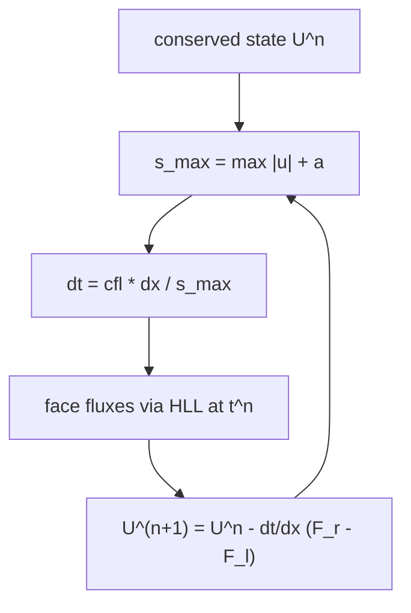

# CFL time-step control

The 1D Euler solver advances explicitly, so every step must obey the
Courant-Friedrichs-Lewy (CFL) condition: the numerical domain of dependence
has to contain the physical one, otherwise the explicit update is unstable
(Courant, Friedrichs & Lewy 1928; see the
 for sources).

## Global step

Each step picks one global time step from the state on all cells:

```
s_max = max over cells of |u| + a
dt    = cfl * dx / s_max
```

`s_max` is the largest characteristic speed of the 1D Euler system, and
`a` is the ideal-gas sound speed from the [equation of state](eos.md). Because
every HLL face wave speed is a characteristic speed of
one of its two adjacent cells, the cell-based maximum bounds every wave in
the numerical flux, so a single pass over the cells is enough.

## Stability

The Courant number `cfl` comes from the case config's
[numerics.cfl](../formats/case-toml.md) and is validated to lie in `(0, 1]`. Forward Euler
with a first-order finite-volume update is stable for `cfl <= 1`; values near
one are the stability limit, and practice lands between 0.4 and 0.9 for
nonlinear problems with shocks.

## Where it sits in the step loop



The step is recomputed from the current state every iteration, so `dt` shrinks
automatically where the flow accelerates and grows again when it settles.

## Notes

- `s_max` is returned alongside `dt` so a driver can report the current CFL
  activity in residuals and logs without a second pass.
- The step uses the cell width `dx` of the uniform 1D grid from the
  [grid geometry](state-grid.md); the non-uniform and 2D cases later generalise
  to `dt = cfl * min_i dx_i / s_max`.
- Higher-order explicit time integrators (RK2, RK3) land after the baseline
  solver and enlarge the usable stability region; the roadmap keeps forward
  Euler as the reference.

## Verification

- Definition values on exactly representable states (`gamma = 2`, `p = 8`
  make `|u| + a` and `dt` exact in binary).
- The fastest cell in a mixed field sets the global step.
- `dt` scales linearly with `cfl` and `dx`.
- Invalid parameters (`cfl` outside `(0, 1]`, non-positive `dx`, `gamma <= 1`)
  and inadmissible states (non-positive density or internal energy) are
  rejected with structured errors.

## Related

- [1D Euler milestone](1d-euler.md)
- [Ideal-gas equation of state](eos.md)
- HLL flux
- [case.toml format](../formats/case-toml.md)
